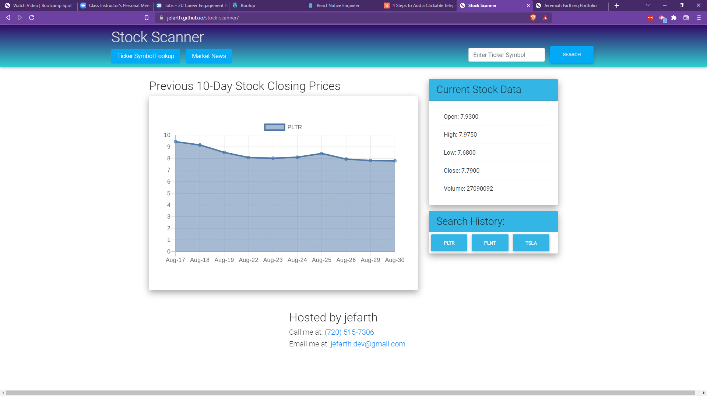

# Stock Scanner
  

  ## Description
  This app allows a user to search for daily stock information for a specific stock ticker symbol and display's that stocks daily information. The user can also check out marketplace news as well as look up ticker symbols for use with the scanner.

  ## Table of Contents 

  * [Preview](#preview)
  * [Installation](#installation)
  * [Usage](#usage)
  * [License](#license)
  * [Contributions](#contributions)
  * [Tests](#tests)
  * [Questions](#questions)

  ## Preview
  

  ## Installation
  Follow these steps to install the application: To install this project first create a new repository on your local machine. Navigate to GitHub and find the "Code" button. Click on it and select "SSH" within the drop down menu. Copy the SSH key. Open up a new terminal inside the new repository you created and write "git clone". Paste the SSH key in after and hit enter.

  ## Usage
  To use this application: This project can be found live here for use: [Access it here!](https://jefarth.github.io/stock-scanner/)
. Click on the search box in the top right corner with the placeholder "Enter Ticker Symbol". Enter a ticker symbol (ex. tsla for Tesla) and hit "SEARCH" or the "ENTER" key. It will auto-capitalize your text so no need to worry about capitalizing anything. After you enter a symbol that is valid it will pull the data up. You can then access the Search History box and click on any prior symbol to pull the data back up. Click on the Ticker Symbol Lookup box to go to a website that will allow you to search for symbols. Simply type in their search box the company you are looking for and it will provide the symbol you need to look up on the Stock Scanner.

  ## License
  This project is licensed under: MIT License.

  ## Contributions
  Contributions made by: I helped create the HTML, styled the CSS with bootstrap, fixed the api call after it updated and broke, and remade the README.

  ## Tests
  Testing on this application was performed by: Testing involved use of Chrome Debugger and console.log()'s to check operation of this basic application.

  ## Questions
  If you have any questions about the application, please contact "jefarth" directly at jefarth.dev@gmail.com